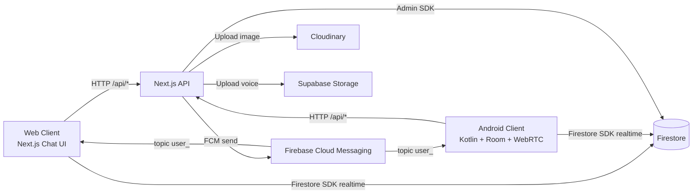
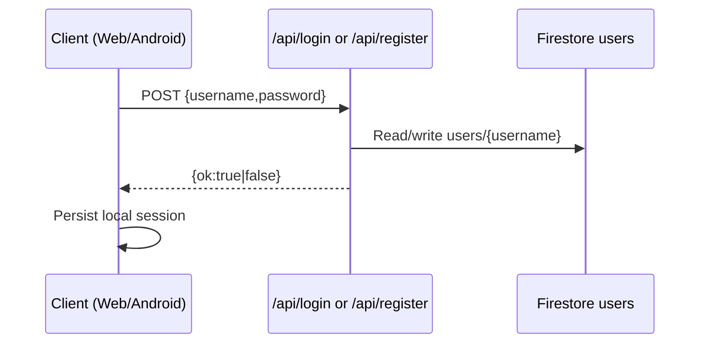
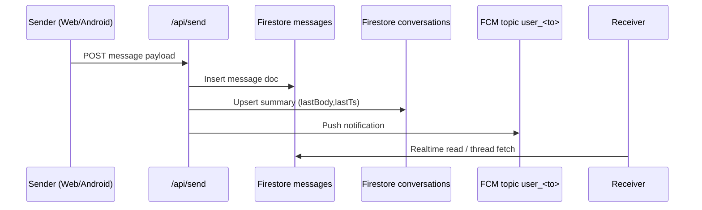
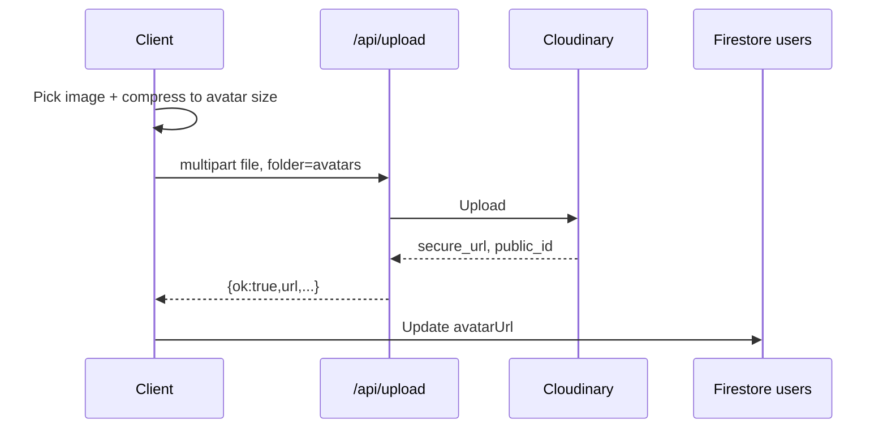
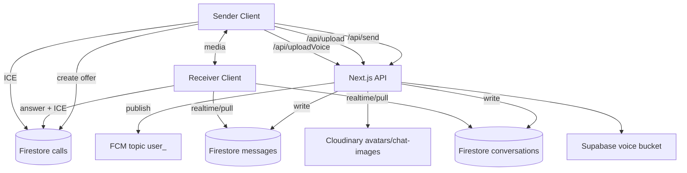

# FINAL SYSTEM DOCUMENTATION

## 1. Full System Overview

Notifier is a cross-platform 1:1 communication system composed of:
- Web client (Next.js, `app/chat/page.jsx`)
- Android client (Kotlin, Room, WebRTC)
- Next.js API backend (`app/api/*/route.js`)
- Firebase Firestore (chat/call state)
- Firebase Cloud Messaging (topic-based push)
- Cloudinary (image upload)
- Supabase Storage (voice note upload)

The API tier handles auth registration/login, message persistence triggers, conversations summary updates, reactions, media upload mediation, and call invite notifications.

## 2. Cross-Platform Architecture



## 3. How Android + Web Interact

They are peer clients over shared backend/data contracts:
- Both call the same API routes (`/api/login`, `/api/register`, `/api/send`, `/api/thread`, `/api/conversations`, `/api/upload`, `/api/uploadVoice`, `/api/callInvite`, `/api/react`).
- Both rely on shared Firestore collections (`users`, `messages`, `conversations`, `calls`).
- Both receive FCM notifications via per-user topics (`user_<username>`).
- Both can participate in WebRTC calls via Firestore signaling docs.

## 4. Complete Flows

### 4.1 Authentication



Observed behavior:
- `/api/login` validates bcrypt hash.
- `/api/register` writes bcrypt hash.
- Web stores credentials in `localStorage` when remember-me is enabled.
- Android stores session in `SharedPreferences` (`Session.kt`).

### 4.2 Chat



Details:
- Web sends encrypted payloads plus optional image/voice metadata.
- Android doc indicates image metadata may also be encoded in body marker format for compatibility.
- Thread loading:
  - Web: Firestore realtime listener on `messages` by participants key.
  - Android: Room stream + backend `/api/thread` sync.
- Conversations:
  - API source: `/api/conversations`.
  - Android also keeps local unread/UI state.
- Replies:
  - Implemented as inline header format in encrypted text payload.
- Reactions:
  - API route `/api/react` toggles `messages/{id}.reactions`.

### 4.3 Avatar



- Web: 512px max, JPEG quality ~0.8, deterministic `publicId=avatar_<username>`, `overwrite=true`.
- Android: similar compression/upload/update flow using Glide for rendering.

### 4.4 Calls (Voice/Video)

```mermaid
sequenceDiagram
  participant Caller
  participant API as /api/callInvite
  participant FCM
  participant FS as Firestore calls
  participant Callee

  Caller->>FS: Create call doc + offer
  Caller->>API: POST callInvite
  API->>FCM: data-only call payload
  FCM-->>Callee: Incoming call signal
  Callee->>FS: Read offer, write answer
  Caller->>FS: Read answer
  Caller->>FS: exchange ICE candidates
  Callee->>FS: exchange ICE candidates
  Caller--Callee: WebRTC media path
```

- Signaling state in `calls` and candidate subcollections.
- Media path is peer-to-peer via WebRTC.
- Current config uses public STUN; TURN fallback not yet integrated.

### 4.5 Notifications

- `/api/send` sends message notification (`notification + data`) to `user_<recipient>` topic.
- `/api/callInvite` sends high-priority data-only call payload.
- Android `MyFirebaseMessagingService` handles data payloads, saves local records, and shows rich notifications/full-screen call UI.

## 5. Data Flow Across API ? Firestore ? FCM ? WebRTC



## 6. End-to-End Scenarios

### Scenario A: Web user sends image to Android user
1. Web compresses image and uploads via `/api/upload` (`chat-images`).
2. Web sends encrypted payload through `/api/send` with image metadata.
3. API writes message + conversation summary and sends FCM topic alert.
4. Android receives push, syncs message (`/api/thread` and/or Firestore), decrypts, and renders image bubble.

### Scenario B: Android starts voice call to Web user
1. Android creates call signaling doc (offer) in Firestore.
2. Android calls `/api/callInvite` to notify web user topic.
3. Web receives incoming call state, fetches signaling doc, creates answer.
4. Both exchange ICE in Firestore subcollections and establish WebRTC media.

## 7. Lifecycle & Synchronization Logic

- Web keeps user `lastSeen` updated on intervals and visibility/unload events.
- Android uses Room as local source-of-truth for fast thread rendering and background message persistence.
- Both clients react to Firestore updates for calls/reactions/avatar changes.
- Cleanup paths (Android `onDestroy`, web call cleanup) release media resources and listeners.

## 8. Security Analysis (Full System)

Key risks identified:
- Incomplete authorization on non-login routes (`/api/send`, `/api/react`, `/api/thread`, `/api/conversations`, `/api/callInvite`) where password is not strongly validated.
- Local credential persistence (web `localStorage`, android stored password) increases compromise impact.
- Predictable FCM user topics can leak notification scope if subscription is not controlled.
- Public media URLs (Cloudinary/Supabase public objects) expose content if links leak.
- `/api/registerDevice` route is missing; no server-side token registration governance shown.
- Security depends heavily on strong Firestore rules (must restrict read/write to proper participants and sensitive fields).

## 9. Performance Analysis

Strengths:
- Realtime Firestore updates for low-latency chat/call state.
- Room caching on Android for offline-first and rapid UI.
- Client-side image compression before upload.
- Limited query windows (messages/conversations up to ~200).

Bottlenecks/risks:
- Client-side decryption overhead on long threads.
- Topic-based notification fanout may deliver metadata broadly if subscription hygiene is weak.
- STUN-only environments can degrade call success under strict NAT/firewalls.

## 10. Limitations

- System is optimized for 1-on-1 communication.
- No robust token-based auth/session revocation model.
- Missing `/api/registerDevice` endpoint.
- Mixed transport for realtime/thread sync (Firestore + HTTP) increases consistency complexity.
- Voice metadata precision (duration) may be incomplete in current web flow.

## 11. Future Improvements

1. Introduce proper auth tokens (JWT/Firebase Auth), rotate/expire sessions, remove raw password storage.
2. Enforce authorization uniformly on all API routes.
3. Implement authenticated device registration API and secure FCM subscription management.
4. Add TURN infrastructure for reliable call connectivity.
5. Harden upload pipeline (content validation, size limits, malware scan, rate limiting).
6. Move sensitive media to signed/private delivery.
7. Add read receipts and reliable cross-device sync semantics.
8. Add OpenAPI spec and automated integration tests for web + Android compatibility.
