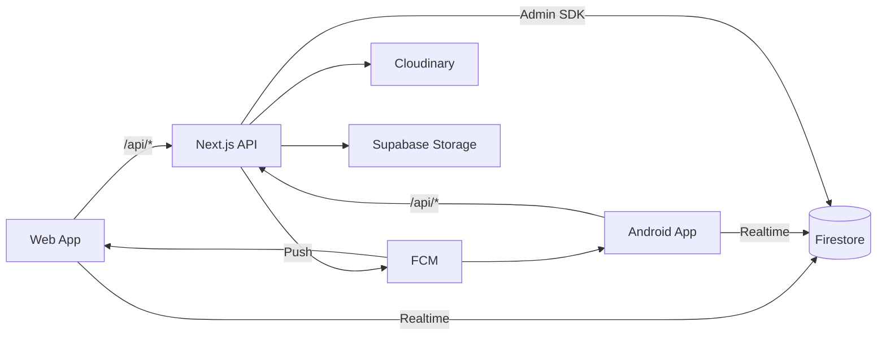
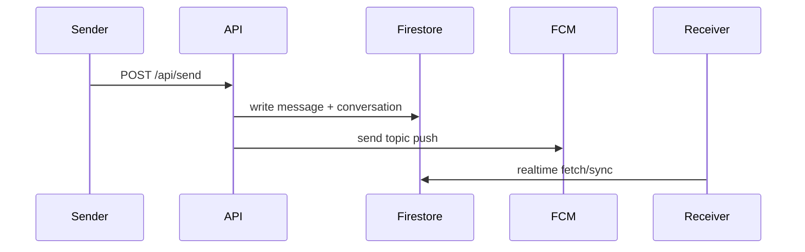

# Notifier

Cross-platform real-time messaging and calling system with Android + Web clients on a shared Next.js API, Firestore, FCM, and WebRTC stack.

## Features

- Username/password login and registration
- 1:1 chat with realtime updates
- End-to-end encrypted payload support (web flow)
- Image messaging (Cloudinary upload)
- Voice note messaging (Supabase Storage upload)
- Message reactions
- Reply-to-message support
- User avatars with compression + cloud upload
- Voice and video calls with Firestore signaling + WebRTC
- Push notifications via FCM data/topic flows
- Android local persistence with Room (messages and call logs)

## Tech Stack

- Web: Next.js (App Router), React, Tailwind, Firebase Web SDK
- Android: Kotlin, Activities, Room, OkHttp, Glide, WebRTC
- Backend/API: Next.js Route Handlers (Node runtime)
- Database/Realtime: Firebase Firestore
- Notifications: Firebase Cloud Messaging (FCM)
- Media: Cloudinary (images), Supabase Storage (voice)

## Architecture Overview



## Screenshots

- `docs/screenshots/web-chat.png` (placeholder)
- `docs/screenshots/android-chat.png` (placeholder)
- `docs/screenshots/android-call.png` (placeholder)
- `docs/screenshots/web-call.png` (placeholder)

## Setup Instructions

### 1. Clone and install

```bash
npm install
```

### 2. Environment variables

Create `.env.local` with required keys:

- Firebase (client):
  - `NEXT_PUBLIC_FIREBASE_API_KEY`
  - `NEXT_PUBLIC_FIREBASE_AUTH_DOMAIN`
  - `NEXT_PUBLIC_FIREBASE_PROJECT_ID`
  - `NEXT_PUBLIC_FIREBASE_STORAGE_BUCKET`
  - `NEXT_PUBLIC_FIREBASE_MESSAGING_SENDER_ID`
  - `NEXT_PUBLIC_FIREBASE_APP_ID`
- Firebase Admin (server):
  - `FIREBASE_CLIENT_EMAIL`
  - `FIREBASE_PRIVATE_KEY`
- Cloudinary:
  - `CLOUDINARY_CLOUD_NAME`
  - `CLOUDINARY_API_KEY`
  - `CLOUDINARY_API_SECRET`
- Supabase (voice upload):
  - `SUPABASE_URL`
  - `SUPABASE_SERVICE_ROLE_KEY`
  - `SUPABASE_VOICE_BUCKET` (optional)
- Optional:
  - `SENDER_PASSWORD` for `/api/notify`

### 3. Run web app

```bash
npm run dev
```

Open:
- `http://localhost:3000/chat` for chat client
- `http://localhost:3000/` for broadcast console

### 4. Android app

Configure base URL in Android `Api.kt` and Firebase settings, then run the app module from Android Studio.

## API Usage Summary

Core routes:
- `POST /api/login`
- `POST /api/register`
- `POST /api/send`
- `GET /api/thread`
- `GET /api/conversations`
- `POST /api/upload`
- `POST /api/uploadVoice`
- `POST /api/react`
- `POST /api/callInvite`

Note: `/api/registerDevice` is currently not implemented in this repository.

## System Diagram



## Future Roadmap

1. Token-based auth (JWT/Firebase Auth) with secure session handling
2. Implement authenticated `/api/registerDevice`
3. TURN servers for resilient WebRTC connectivity
4. Signed/private media delivery
5. Group chat and read receipts
6. OpenAPI contract + integration tests
