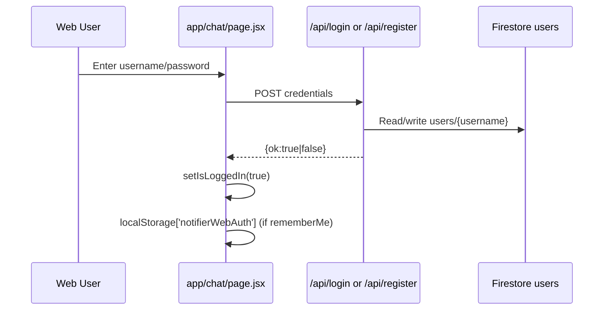
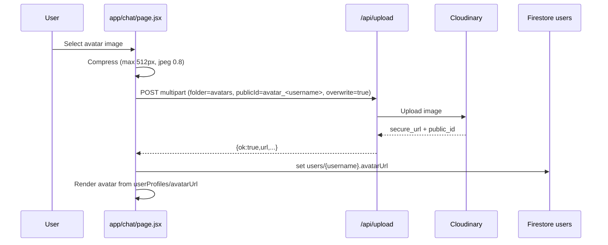
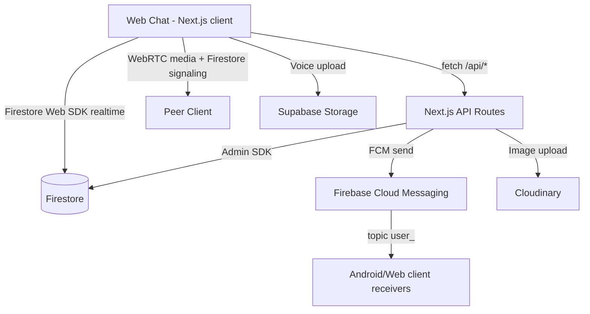

# WEB API Documentation

## 1. Web App Overview

This repository is a Next.js App Router project that provides:
- A web chat client (`/chat`) with login/register, encrypted messaging, reactions, avatar upload, and WebRTC call signaling.
- Server API routes (`/api/*`) for auth, messaging, conversation summaries, media upload, reactions, and call invite push notifications.
- Firestore-backed realtime data (`users`, `messages`, `conversations`, `calls`).

Primary entry points:
- `app/chat/page.jsx` for chat/auth/call UI and client-side flows.
- `app/api/*/route.js` for backend APIs.

## 2. Next.js Project Structure

```text
app/
  layout.jsx
  page.jsx                    # Broadcast sender UI (/api/notify)
  chat/page.jsx               # Main chat/auth/call frontend
  api/
    login/route.js
    register/route.js
    send/route.js
    thread/route.js
    conversations/route.js
    upload/route.js
    uploadVoice/route.js
    react/route.js
    callInvite/route.js
    notify/route.js
lib/
  firebaseClient.js           # Firebase Web SDK init (client)
  firebaseAdmin.js            # Firebase Admin init (server)
  calls.js                    # Shared call constants/helpers
```

## 3. Important Frontend Files

### `app/chat/page.jsx`

Main responsibilities:
- Login/register form logic via `/api/login` and `/api/register`.
- Session persistence using `localStorage` (`notifierWebAuth`).
- E2E key setup (ECDH/AES-GCM payload encryption) and Firestore `users/{username}.publicKeyJwk` updates.
- Conversation list load via `/api/conversations`.
- Realtime thread using Firestore `messages` snapshot query by `participants` key.
- Message send via `/api/send` with encrypted payload.
- Reply UX via inline body prefix format (`? <author>: <snippet>\n\n<text>`).
- Reaction toggle via `/api/react`.
- Chat image upload and avatar upload via `/api/upload`.
- Voice note upload via `/api/uploadVoice`.
- Call invite trigger via `/api/callInvite`; WebRTC signaling data in Firestore `calls` + candidates subcollections.

### Login/Register Pages

No dedicated routes like `app/login/page.jsx` or `app/register/page.jsx` are present.
- Login/register UI is embedded in `app/chat/page.jsx` and controlled by `authMode`.

### Profile/Avatar UI

Present in `app/chat/page.jsx`:
- Avatar render via `Avatar` component with fallback initials.
- Avatar image picker and upload handler `handleAvatarSelect`.
- Firestore profile update: `users/{username}.avatarUrl` and `avatarUpdatedAt`.

## 4. Backend API Routes

### `POST /api/login` (`app/api/login/route.js`)
- Input: `{ username, password }`
- Behavior:
  - Reads `users/{username}`.
  - Validates `password` against `passwordHash` with `bcrypt.compare`.
- Output:
  - `200 { ok: true }`
  - `401 { ok:false, error:'invalid credentials' }`

### `POST /api/register` (`app/api/register/route.js`)
- Input: `{ username, password }`
- Behavior:
  - Rejects if `users/{username}` exists.
  - Stores `passwordHash` using bcrypt.
- Output:
  - `200 { ok: true }`
  - `400 { ok:false, error:'username already exists' }`

### `POST /api/send` (`app/api/send/route.js`)
- Input: `{ username, password, to, body, encrypted, image, voice }`
- Behavior:
  - Checks sender/receiver user docs exist.
  - Accepts encrypted payload and/or plain text/media.
  - Writes `messages` doc.
  - Upserts `conversations/{sortedUserA_userB}` summary.
  - Sends FCM to topic `user_<to>`.
- Output:
  - `200 { ok:true, id, ts, type, image, voice }`

### `GET /api/thread` (`app/api/thread/route.js`)
- Query: `username`, `with`, optional `after`, optional `limit`.
- Behavior:
  - Verifies requesting user exists.
  - Queries `messages` by `participants` and optional timestamp cursor.
  - Returns chronological list.
- Output:
  - `200 { ok:true, messages:[...] }`

### `GET /api/conversations` (`app/api/conversations/route.js`)
- Query: `username` (password param accepted but unused)
- Behavior:
  - Verifies user exists.
  - Reads from `conversations` where `participantsArr` contains user.
- Output:
  - `200 { ok:true, conversations:[{ other, lastBody, lastTs }] }`

### `POST /api/upload` (`app/api/upload/route.js`)
- Multipart form fields:
  - `file` (required)
  - `folder` (`chat-images` or `avatars` only)
  - `publicId` (optional)
  - `overwrite` (optional, `'true'` enables overwrite + invalidate)
- Behavior:
  - Uploads to Cloudinary.
- Output:
  - `200 { ok:true, url, width, height, bytes, format, publicId }`

### `POST /api/callInvite` (`app/api/callInvite/route.js`)
- Input: `{ username, to, callId, callType }`
- Behavior:
  - Verifies caller/receiver users exist.
  - Sends **data-only** FCM call payload to topic `user_<to>`.
- Output:
  - `200 { ok:true, ts }`

### `POST /api/react` (`app/api/react/route.js`)
- Input: `{ username, password, messageId, emoji }` (password unused)
- Behavior:
  - Reads target message.
  - Verifies user belongs to `participantsArr`.
  - Toggles emoji reaction at `reactions[emoji][username]`.
- Output:
  - `200 { ok:true, reactions }`

### `POST /api/registerDevice`
- **Not found in this repository**.
- No `app/api/registerDevice/route.js` currently exists.

## 5. Authentication Flow



Notes:
- No JWT/session cookie implementation.
- Credentials are stored in browser `localStorage` in plaintext JSON when `rememberMe` is enabled.
- API auth is inconsistent across routes; several endpoints do not verify password.

## 6. Chat Flow

### Send message
1. User composes text and optional image/voice draft.
2. Payload encrypted client-side (`encryptPayloadFor`).
3. Frontend optimistic append.
4. `POST /api/send` with encrypted payload.
5. Backend writes `messages`, updates `conversations`, sends FCM topic notification.

### Load thread
- Web uses Firestore realtime listener directly (not `/api/thread`) with query by sorted `participants` key and `orderBy(ts)`.
- `/api/thread` exists for API consumers (e.g., Android or fallback polling).

### Conversations
- `GET /api/conversations` loads summaries.
- Frontend also updates last preview locally when new messages arrive.

### Replies
- Reply metadata encoded into message text header format, then encrypted.
- UI parses with `parseReplyBody` and renders reply snippet block.

### Reactions
- Local optimistic toggle.
- Server toggle persisted in message doc via `/api/react`.

## 7. Avatar/Profile Flow



## 8. Upload System

### Cloudinary folders
- Chat images: `chat-images`
- Avatars: `avatars`

### `publicId` and overwrite
- Chat images: no fixed `publicId` from frontend.
- Avatar: frontend sets deterministic `publicId=avatar_<username>` and `overwrite=true`; backend also sets `invalidate=true` for cache busting.

### Voice upload (separate path)
- Voice notes use `/api/uploadVoice` and Supabase Storage bucket (default `voice-notes`), not Cloudinary.

## 9. Notification/API Flow

### `callInvite`
- `/api/callInvite` sends high-priority Android FCM data payload to topic `user_<to>`.
- Payload includes: `type=call`, `callType`, `sender`, `toUser`, `callId`, `ts`, plus title/body text fields.

### FCM data-only behavior
- `callInvite` payload is data-only (no notification block).
- `/api/send` includes both `notification` and `data` blocks.

### `registerDevice`
- Route is missing in this codebase; device-topic subscription is expected to be performed on client side (Android/web if applicable).

## 10. Firestore Usage

Collections used:
- `users`
  - Auth records (`passwordHash`, `createdAt`)
  - Presence/profile (`lastSeen`, `avatarUrl`, `avatarUpdatedAt`, `publicKeyJwk`)
- `messages`
  - Chat message docs (`from`, `to`, `participants`, `participantsArr`, `type`, `body`, `image`, `voice`, `encrypted`, `reactions`, `ts`)
- `conversations`
  - Per pair summary (`participants`, `participantsArr`, `lastBody`, `lastTs`, `lastFrom`)
- `calls`
  - Call signaling and call state (`status`, offer/answer SDP, etc.)
  - Subcollections: `callerCandidates`, `receiverCandidates`
- `call_logs` (frontend write path present in `chat/page.jsx`)

## 11. API Request/Response Examples

### Login
```http
POST /api/login
Content-Type: application/json

{"username":"alice","password":"secret"}
```
```json
{"ok":true}
```

### Register
```http
POST /api/register
Content-Type: application/json

{"username":"alice","password":"secret"}
```
```json
{"ok":true}
```

### Send encrypted message
```http
POST /api/send
Content-Type: application/json

{
  "username": "alice",
  "password": "secret",
  "to": "bob",
  "body": "",
  "encrypted": {
    "ciphertext": "...",
    "iv": "...",
    "senderPubKeyJwk": "...",
    "v": 1
  }
}
```
```json
{"ok":true,"id":"<messageId>","ts":1710000000000,"type":"encrypted"}
```

### Upload image
```http
POST /api/upload
Content-Type: multipart/form-data
# file=<binary>, folder=chat-images
```
```json
{"ok":true,"url":"https://...","width":1080,"height":720,"publicId":"chat-images/..."}
```

### React
```http
POST /api/react
Content-Type: application/json

{"username":"alice","messageId":"abc123","emoji":"??"}
```
```json
{"ok":true,"reactions":{"??":{"alice":true}}}
```

## 12. External Clients

### Web frontend usage
- Directly uses:
  - `/api/login`, `/api/register`, `/api/send`, `/api/conversations`, `/api/upload`, `/api/uploadVoice`, `/api/react`, `/api/callInvite`
- Uses Firestore realtime for message and call signaling.

### Android app usage through `Api.kt`
- `Api.kt` is not present in this repository.
- Existing handoff file `ANDROID_CHATGPT_HANDOFF.md` indicates Android should call:
  - `/api/upload`
  - `/api/send`
  - `/api/thread`
- Android is expected to consume FCM topic `user_<username>`.

## 13. Security Analysis

### Auth weaknesses
- No token/session layer; many routes accept `username` and only verify document existence.
- `/api/send`, `/api/react`, `/api/thread`, `/api/conversations`, `/api/callInvite` do not validate password hash.
- Plain credentials may be stored in browser localStorage (`notifierWebAuth`).

### Upload validation
- `/api/upload` validates only folder whitelist, not strict file MIME/content signature and size limits server-side.
- `/api/uploadVoice` allows service-role upload path; access control depends on endpoint protection and env secrecy.

### Public media URLs
- Cloudinary and Supabase returned URLs are public.
- Anyone with URL can fetch unless provider-side signed/private delivery is enforced.

### FCM/topic risks
- Topic naming `user_<username>` is predictable.
- If clients can subscribe arbitrarily, notifications can leak metadata.

### Firestore rules requirements
- Strong Firestore Security Rules are mandatory to enforce:
  - user-scoped read/write on `messages`, `conversations`, `calls`, `users` profile fields,
  - block unauthorized updates to other users' documents,
  - restrict sensitive fields (`passwordHash`) from client access.

## 14. Performance Notes

- Realtime message query limits to last 200 docs; helps chat rendering bounds.
- Conversations query limit is 200.
- Message decryption is performed client-side and cached in-memory (`decryptedById`).
- Avatar/profile fetch loop can re-run as dependencies change; could be optimized with batched fetch/cache invalidation strategy.
- Local image compression before upload reduces payload size significantly.

## 15. Known Limitations

- `/api/registerDevice` route missing though expected in overall system design.
- Password parameter unused on multiple routes.
- No formal refresh token/session expiration/logout invalidation model.
- Call signaling and call records rely on client correctness; no server-side call state enforcement.
- Voice note duration metadata currently set to `0` at send time from web client.
- Encoding artifacts appear in some source literals/comments (mojibake characters).

## 16. Future Improvements

1. Introduce real auth (Firebase Auth or signed JWT + secure httpOnly cookies).
2. Remove plaintext credential storage from localStorage.
3. Enforce authorization checks on all API routes.
4. Implement `/api/registerDevice` with authenticated user-token registration and controlled topic subscription.
5. Add strict upload validation (mime sniffing, size caps, virus scanning, rate limits).
6. Move public media to signed URLs or private access patterns where needed.
7. Add server-side auditing for calls/messages/reactions and abuse detection.
8. Add structured API schema docs (OpenAPI) and integration tests.

## System Architecture Diagram


